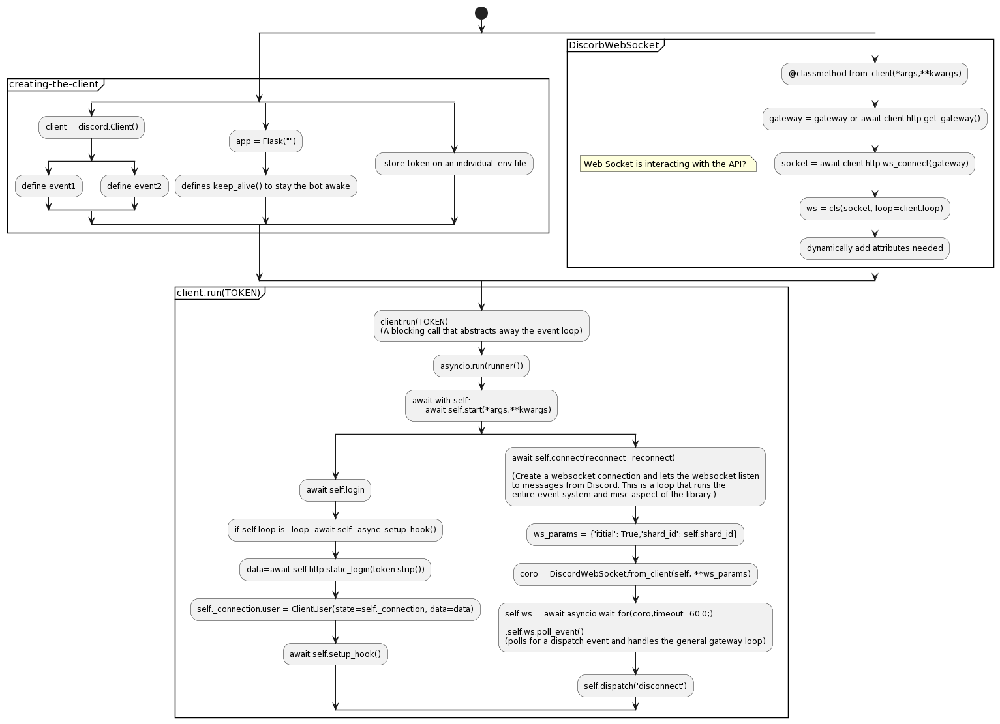

# Keyword-listening-discord-bot

This is my own trial of constructing a discord bot.

How it works: 

- This bot listens to all messages from a discord server (need to specify token and guild ID)
- When some predefined commands or keywords is noticed, it would response to the messages accordingly.
- In my take, my discord bot is a help which send out the informations from `Manual`, so the coder members in the server can get instant information by commands. 

# Design charts

- Blueprint of this discord bot is provided in `Images` folder. Welcome to take a look.

